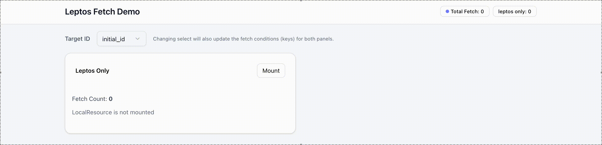
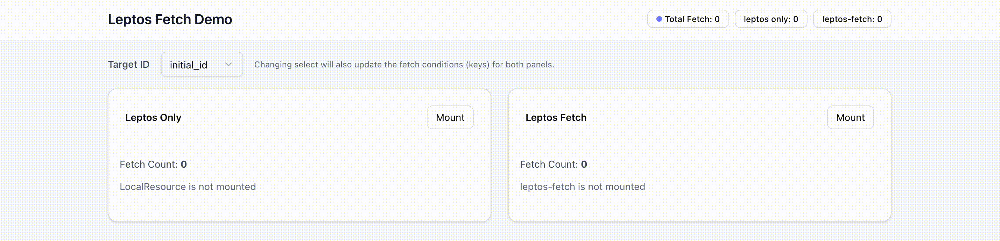
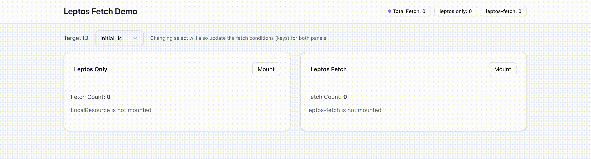
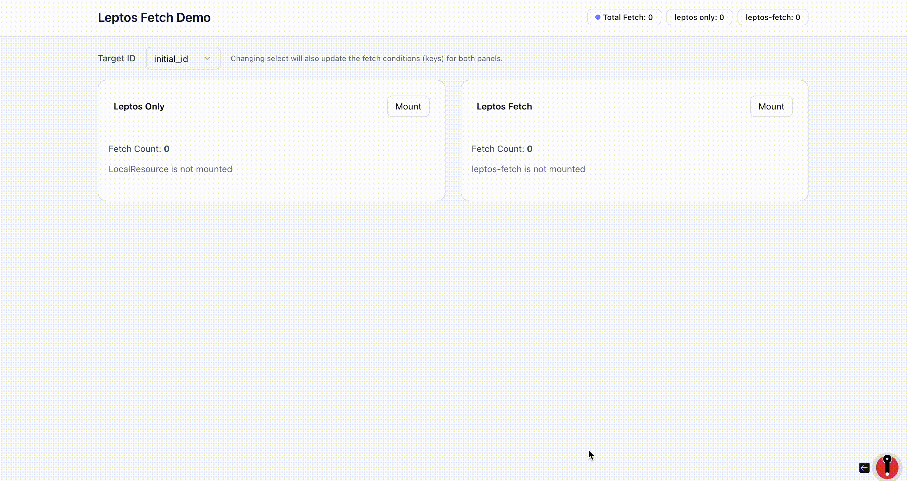

# Leptos Fetch Example

This is a simple demo example of using Leptos Fetch to manage data fetching in a Leptos application.

## Watch and Serve

```sh
# Need to install `trunk` for build
trunk serve
```

You can try to see the demo at https://nopenoshishi.github.io/leptos-fetch-demo/.

## Example Video

### Leptos Only



### Leptos Fetch



### Auto Refresh


### Force Refetch


### Devtools

